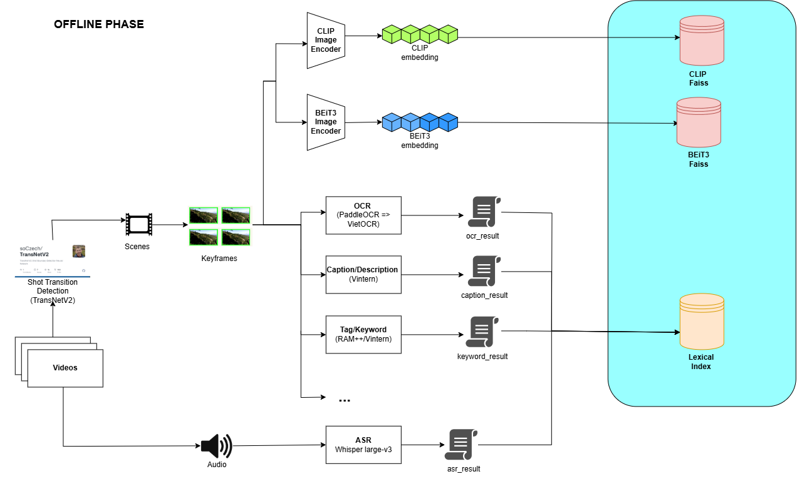
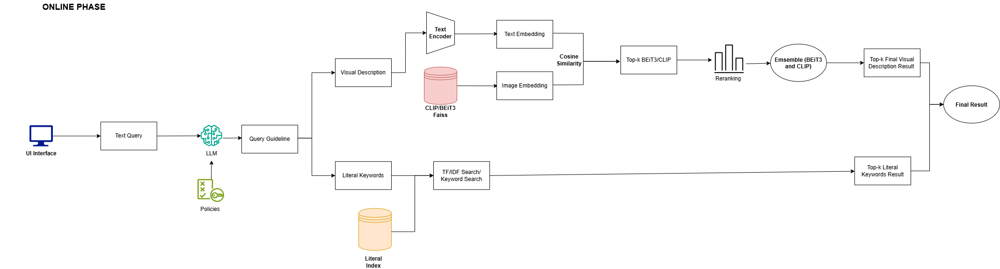

# Kiến trúc pipeline AIC 2026

> Nguồn sự thật cho kiến trúc hệ thống truy xuất khoảnh khắc video, vòng sơ tuyển
> AI Challenge HCMC 2026. Sửa file này trước, rồi mới cập nhật các bản sao khác.
>
> **Cập nhật lần cuối:** 2026-08-05
> **Bản web (chia sẻ cho nhóm):** https://claude.ai/code/artifact/e18f8381-00ba-401e-afe5-ec1b0d2680f9
>
> **Sơ đồ chốt hiện hành: v1** — [offline](pipeline_aic2026_offline_phase_v1.png) ·
> [online](pipeline_aic2026_online_phase_v1.png). Xem [mục 3](#3-sơ-đồ-tổng-quan).
> Sơ đồ là nguồn sự thật về **hình dạng** pipeline; văn bản dưới đây là nguồn sự thật
> về **tham số và lý do**. Hai bên lệch nhau thì sửa cả hai, đừng sửa một.

---

## Mục lục

1. [Bối cảnh và ràng buộc](#1-bối-cảnh-và-ràng-buộc)
2. [Hiện trạng code](#2-hiện-trạng-code)
3. [Sơ đồ tổng quan](#3-sơ-đồ-tổng-quan)
4. [Bước 0 — Hạ tầng đo đạc](#bước-0--hạ-tầng-đo-đạc)
5. [Phần A — Offline](#phần-a--offline-dựng-kho)
6. [Phần B — Online](#phần-b--online-xử-lý-truy-vấn)
7. [Danh sách model](#7-danh-sách-model)
8. [Bảng thí nghiệm Q1–Q11](#8-bảng-thí-nghiệm-q1q11)
9. [Đã chốt — đừng bàn lại](#9-đã-chốt--đừng-bàn-lại)
10. [Lịch chia đợt](#10-lịch-chia-đợt)
11. [Kế hoạch Backblaze B2](#11-kế-hoạch-backblaze-b2)
12. [Câu hỏi còn để ngỏ](#12-câu-hỏi-còn-để-ngỏ)

---

## 1. Bối cảnh và ràng buộc

### 1.1. Hàm mục tiêu

Mỗi truy vấn được nộp **tối đa 100 đáp án**. Mỗi đáp án nhận một **R-Score** ∈ [0,1].

| Dạng | Định dạng nộp | Điều kiện đúng |
|---|---|---|
| **Textual KIS** | `video_id, frame_id` | đúng video **và** `frame_id ∈ [s,e]` |
| **Q&A** | `video_id, frame_id, answer` | như KIS, **và** answer khớp ngữ nghĩa |
| **TRAKE** | `video_id, frame_1, …, frame_n` | sai video → **0 ngay lập tức**; đúng video → tỉ lệ mốc khớp |

Điểm cuối cùng:

```
R@k        = max R-Score trong k đáp án đầu tiên
Final Score = (R@1 + R@5 + R@20 + R@50 + R@100) / 5
```

**Hai hệ quả bắt buộc nhớ:**

- **R@1 chiếm 20% điểm** → thứ hạng quan trọng ngang với việc tìm ra đáp án. Rerank không phải thứ làm sau cùng cho đẹp.
- **R@100 gần như miễn phí** → luôn nộp đủ 100 dòng. Với KIS nên bung nhiều frame trong cùng một shot ứng viên để phủ khoảng `[s,e]`, thay vì 100 shot khác nhau mỗi shot một frame.

Cửa sổ đáp án TRAKE **thường dưới 10 frame**. Đây là ràng buộc khắc nghiệt nhất trong cả đề.

### 1.2. Dữ liệu

- **Batch 1 = L21–L30.** Giống hệt batch 1 của AIC 2025.
- BTC cấp: video (dữ liệu thi chính thức), keyframes, objects (Faster R-CNN / OpenImages V4), CLIP ViT-B/32 features, metadata YouTube.
- Batch 2 sẽ thông báo sau.

### 1.3. Đặc điểm query — rút từ 89 câu năm 2025

Xem [Danh_gia_Query_AIC2025.md](Danh_gia_Query_AIC2025.md). Phân bố: **KIS 73 (82%), QA 9 (10%), TRAKE 7 (8%)**.

Sáu đặc điểm chi phối mọi quyết định thiết kế phía dưới:

1. **Query dài 100–150 từ, mô tả một chuỗi nhiều cảnh**, không phải một khung hình.
   *"Mở đầu là cầu vòm thép đỏ… khoảng 30 giây sau kết thúc bằng ca nô tạo vệt sóng tròn"* (R2-8).
2. **Chi tiết thị giác rất mịn** — màu áo từng người, vị trí trái/phải, số lượng.
3. **Rất nhiều câu bám vào chữ trên màn hình** — `Nà Ní`, `Happy New Year`, `9.00€`, `Gừng cay muối mặn`, `Bánh Dân Gian Miền Tây`.
4. **Cần kiến thức nền ngoài video** — R1-23 nói "phim của Spielberg 1975" mà không nói "cá mập".
5. **QA cần đếm và suy luận**, không chỉ truy xuất.
6. **TRAKE toàn chuỗi 2–4 sự kiện** kiểu "khoảnh khắc **đầu tiên** X chạm Y".

### 1.4. Ràng buộc mô hình cần nhớ

| Model | Giới hạn token văn bản |
|---|---|
| SigLIP-large-384 | **64** |
| CLIP ViT-H/14 | 77 |
| BEiT-3 (chế độ retrieval) | ~64 |

Query 150 từ tiếng Việt dịch sang tiếng Anh ≈ 180 token → **bị cắt bỏ khoảng 2/3, im lặng, không báo lỗi**.

Đổi model **không cứu được** — cả ba đều là model câu ngắn. Cách duy nhất là **phân rã truy vấn** ở bước 5.

---

## 2. Hiện trạng code

### 2.1. Offline — notebook

| Notebook | Vai trò | Trạng thái |
|---|---|---|
| `notebooks/(thanhbangcao)FULL_PIPELINE_AIC_2026(2).ipynb` | **bản đang dùng** — cắt keyframe, dựng 2 FAISS, OCR/ASR/caption/tags/objects. `OUTPUT_ROOT = MyDrive/AIC2026` | đang dùng |
| `notebooks/thanhbangcao/01_cut_and_index.ipynb` | bản tách nhỏ của khâu cắt + index | ⚠️ còn trỏ `aic26/output_demo/v004`, phải đổi sang `AIC2026` |
| `notebooks/thanhbangcao/02–05` | 4 lab: SigLIP/YOLO/màu · OCR/ASR · Vintern/RAM++ · trích đặc trưng | đang dùng |
| `notebooks/[01_08]_FULL_PIPELINE_AIC_2026_Ver1.ipynb` | bản gốc 3 cell khổng lồ, chứa phòng lab | lưu trữ, không sửa |

**Đã xoá:** `notebooks/pipeline/` (kèm `05_cham_diem.ipynb`, `ground_truth_2025.json`)
và `PIPELINE_AIC_2026_v003.ipynb`. Mọi liên kết tới chúng trong tài liệu này đều **chết** —
xem [mục 2.3](#23-nợ-kỹ-thuật-đang-chặn).

### 2.2. Online — backend

| File | Nội dung | Trạng thái |
|---|---|---|
| `backend/app/preprocess.py` | Alg.2 (rerank từng model) · Alg.3 (ensemble) · Alg.4 (temporal) · chế độ demo | ✅ **viết lại 2026-08-05** |
| `backend/app/main.py` | 5 endpoint: `/ensemble-search` `/single-search` `/temporal-search` `/status` `/health` | ✅ **viết lại 2026-08-05** |
| `backend/app/models.py` | schema pydantic | giữ nguyên |
| `backend/app/agent.py` | sinh từ khoá qua API | ⚠️ **mồ côi** — không endpoint nào import nữa |

**Đã bỏ khỏi backend:** `/text-search`, `/text-no-agent-search`, `/faiss-search`,
`/ocr-search`, `/combined-search`, `/filter-search`. Chúng đọc `temp.json` với các trường
`content/ocr/object/color/action` của mùa trước — pipeline hiện tại không sinh ra file đó
nên chúng luôn trả rỗng mà vẫn HTTP 200, tức **thất bại im lặng**.

**Chế độ demo:** không có `beit3.index`/`clip.index` thì backend tự sinh dữ liệu giả, tất
định theo truy vấn, đúng y hình dạng JSON thật. Frontend dựng được trước khi index xong.
Bật cưỡng bức bằng `AIC_DEMO=1`; kiểm bằng `GET /status`.

**Ba biến môi trường:**

| Biến | Để làm gì |
|---|---|
| `AIC_INDEX_DIR` | trỏ tới `AIC2026/indexes/` — mặc định `backend/app/indexes/` |
| `AIC_IMAGE_BASE_URL` | gốc URL ảnh. Đổi sang Backblaze **không phải index lại** |
| `AIC_DEMO` | ép chế độ demo kể cả khi đã có index |

### 2.3. Nợ kỹ thuật đang chặn

| # | Việc | Chặn cái gì |
|---|---|---|
| 1 | **Dựng lại notebook chấm điểm** (đã xoá cùng `notebooks/pipeline/`) | **Q4, Q5, Q6, Q7 — toàn bộ** |
| 2 | Đệm số 0 tên ảnh `{frame:06d}` | sửa sau khi cắt = **cắt lại 873 video** |
| 3 | `det_limit_side_len=1920` cho PaddleOCR | mặc định 960 vứt hết lợi thế của Q3 |
| 4 | Bỏ prompt `Tags (EN)` của Vintern khi RAM++ chạy được | phí một nửa thời gian Vintern |
| 5 | Vintern 1 ảnh/cảnh thay vì mọi ảnh | nhanh gấp 3,6 lần |
| 6 | Dịch bộ từ vựng RAM++/YOLO sang tiếng Việt | tag tiếng Anh **không khớp** query tiếng Việt trong BM25 |

Mục 1 chặn nhiều nhất. Mục 2 gấp nhất — nó nằm ở khâu cắt.

---

## 3. Sơ đồ tổng quan

### 3.1. Offline v1



Sáu nhánh xuất phát từ hai nguồn:

| Nhánh | Chuỗi | Đích |
|---|---|---|
| Ảnh · thô | `Keyframes → CLIP Image Encoder → CLIP embedding` | **CLIP Faiss** |
| Ảnh · chi tiết | `Keyframes → BEiT3 Image Encoder → BEiT3 embedding` | **BEiT3 Faiss** |
| Chữ trên màn hình | `Keyframes → PaddleOCR ⇒ VietOCR` | `ocr_result` |
| Mô tả cảnh | `Keyframes → Vintern` | `caption_result` |
| Nhãn nội dung | `Keyframes → RAM++ / Vintern` | `keyword_result` |
| Lời nói | `Videos → Audio → Whisper large-v3` | `asr_result` |

Bốn file `*_result` đổ chung vào **Lexical Index**. Hai FAISS để **riêng**, không gộp —
đúng như Alg.3 của bài báo yêu cầu: mỗi model tìm trên index của chính nó rồi mới gộp
điểm, chứ không nhét hai không gian vector khác chiều vào một chỗ.

**Bốn thứ sơ đồ chưa vẽ nhưng bắt buộc phải có:**

| Thiếu | Vì sao cần |
|---|---|
| **`keyframe_metadata.json`** | FAISS chỉ trả về *số thứ tự vector*. File này biến số đó thành `video_id + frame_idx`. Không có nó thì hai trụ FAISS vô dụng. |
| Nhãn `frame = giây × fps` trên cạnh `asr_result → Lexical Index` | ASR gắn với **khoảng giây**, mọi thứ khác gắn với **frame**. Đây là chỗ dễ sai nhất và sai thì không ai phát hiện tới lúc chấm điểm. |
| Nhãn quy tắc lấy mẫu trên cạnh `Scenes → Keyframes` | `n=2` tới 1,67 s, sau đó +1 ảnh mỗi 2 s, kẹp [2,40], lùi biên 3 frame — xem [Q1 đã chốt](#8-bảng-thí-nghiệm-q1q11). |
| Khoá gộp `video_id + frame_idx` ghi dưới **Lexical Index** | Bốn nguồn chỉ nối được với nhau nếu cùng khoá. |

**Hộp `...` còn để trống** là chỗ dành cho `YOLO11L → object_result`. Ngoài ra còn một
nguồn nữa chưa có trên sơ đồ: **`media-info/*.json`** (873 file, đã có sẵn của BTC) —
`publish_date`, `title`, `author` đi thẳng vào Lexical Index, không phải chạy model nào.

### 3.2. Online v1



```
UI → Text Query → LLM (+ Policies) → Query Guideline
                                          ├─→ Visual Description ─→ tuyến ảnh
                                          └─→ Literal Keywords   ─→ tuyến từ vựng
```

**Tuyến ảnh:** `Text Encoder → Text Embedding` gặp `Image Embedding` lấy từ
`CLIP/BEiT3 Faiss` tại `Cosine Similarity` → `Top-k BEiT3/CLIP` → **`Reranking`** →
**`Ensemble`** → `Top-k Final Visual Description Result`.

**Tuyến từ vựng:** `Literal Keywords → TF-IDF / Keyword Search` (đọc `Literal Index`)
→ `Top-k Literal Keywords Result`.

Hai tuyến gặp nhau ở `Final Result`.

> 🔴 **Thứ tự đã chốt: `Reranking` đứng TRƯỚC `Ensemble`.** Xem [mục 9.6](#96-thứ-tự-rerank--ensemble)
> — quyết định này khác bản backend cũ và khác cách đọc thông thường của bài báo, nên
> đừng đảo lại.

**Sáu bước có trong văn bản nhưng chưa có trên sơ đồ v1:**

| Thiếu | Mã | Ghi chú |
|---|---|---|
| Hộp hợp nhất hai tuyến chưa có tên | bước 7 · **Q8** | Cộng thẳng là sai: BM25 cho 11,42 còn cosine cho 0,28. Phải là **RRF theo hạng**. |
| Gom theo shot | bước 8 · **Q9** | 100 dòng nộp phải là 100 khoảnh khắc **khác nhau**, không phải 4 ảnh liền nhau của cùng một cảnh. |
| VLM rerank | bước 9.2 · **Q10** | Chỉ chạy top-20; top-100 mất 50–200 giây. |
| Temporal Search (Alg.4) | bước 10.3 · **Q11** | **Backend đã có** `/temporal-search`, sơ đồ chưa vẽ. |
| Tách nhánh KIS / QA / TRAKE | bước 10 | Ba dạng có định dạng nộp khác nhau. |
| Xuất file nộp | bước 12 | Thứ tự dòng chính là điểm — R@1 chiếm 20%. |

**Đã bỏ khỏi bản vẽ trước:** nhánh `Search Option Guideline` (LLM tự chọn bật/tắt tuyến
và trọng số). Chưa quyết bỏ hẳn hay hoãn — ghi lại ở [mục 12](#12-câu-hỏi-còn-để-ngỏ).

### 3.3. Sơ đồ đối chiếu với bài báo

Khung đứt nét là phần **paper 2504.08384 có**; phần ngoài là hai nhánh nhóm tự thêm:

```
┌─ paper có ─────────────────────────────────────────┐
│  Keyframes → Encoder → FAISS → Reranking (§3.3)    │
│           → Ensemble (§3.4) → Temporal (§3.5)      │
└────────────────────────────────────────────────────┘
   nhóm thêm:  ⬅ LLM phân rã truy vấn      (đầu)
               ⬅ Tuyến từ vựng OCR/ASR/... (giữa)
```

Paper **chỉ có tuyến ảnh**. Với query kiểu R1-17 (trích nguyên văn chữ trên phông sân
khấu) thì paper không có đường nào chạm tới — đó là lý do tồn tại của Lexical Index.

---

## Bước 0 — Hạ tầng đo đạc

> **Phải xong trước khi ai bắt đầu test bất cứ thứ gì.** Nếu mỗi người tự đo theo
> cách riêng, buổi họp chốt sẽ có nhiều bảng số không so được với nhau.

> 🔴 **Cập nhật 2026-08-05 — notebook chấm điểm đã bị xoá** cùng thư mục
> `notebooks/pipeline/`. Nội dung 0.1–0.3 dưới đây từng làm xong nhưng **hiện không còn
> file nào**. Phải dựng lại trước khi chạy bất kỳ thí nghiệm Q nào. Xem
> [mục 2.3](#23-nợ-kỹ-thuật-đang-chặn).

| Mã | Việc | Ghi chú |
|---|---|---|
| **0.1** | Chuẩn hoá đáp án 2025 | ⚠️ **phải dựng lại** — nội dung đã biết: 89 câu, 63 `confirmed` + 5 `video_only`; tập đo lọc còn **30 câu L-series** (21 KIS, 5 QA, 4 TRAKE), tất cả đều có frame. Đích mới: `AIC2026/gt_eval.json` + bản commit trong repo. |
| **0.2** | Hàm chấm điểm đúng luật | ⚠️ **phải dựng lại** — R-Score riêng cho KIS / QA / TRAKE, rồi `Final Score`. Ba ô là đủ: nạp GT + kết quả → tính R@1/5/20/50/100 → in bảng so nhiều lần chạy. |
| **0.3** | Một định dạng kết quả duy nhất | ✅ **đã chốt lại 2026-08-05** → `AIC2026/ket_qua/<run_id>.json`, một file một lần chạy, chứa mọi query. Xem [mục 0.6](#06-định-dạng-file-kết-quả). |
| **0.4** | Phép đo trần trên | Với mỗi câu GT: đáp án đúng có nằm trong top-100 không, ở hạng bao nhiêu. |

**0.4 quan trọng hơn vẻ ngoài của nó.** Nếu tỉ lệ trong top-100 cao (>60%) thì vấn đề của nhóm là **rerank và giao diện**. Nếu thấp thì vấn đề là **tầng recall**. Hai kết luận dẫn tới hai kế hoạch hoàn toàn khác nhau — đo trước đỡ mất vài ngày đi sai hướng.

### 0.5. Hai điều bắt buộc biết về tập đáp án

> ⚠️ **Đáp án trong `GROUND_TRUTH` trong notebook không phải đáp án chính thức của BTC.** Chúng do người
> viết [Danh_gia_Query_AIC2025.md](Danh_gia_Query_AIC2025.md) tự suy luận. Mức **video**
> đáng tin; mức **frame** chỉ nên coi là gần đúng.

**Hệ quả kỹ thuật:** BTC chấm bằng khoảng `[s,e]`, nhưng file của nhóm chỉ có **frame đơn**.

**Quyết định (2026-08-03): chấm đúng công thức BTC, không dùng công thức xấp xỉ nào.**
Câu nào chưa có `[s,e]` thì tạm bỏ điều kiện frame — tức chỉ xét **đúng video hay không**.
Ai xác minh xong câu nào, điền `FRAME_RANGES` ở **ô A3** của notebook chấm điểm *(đã xoá — [phải dựng lại](#23-nợ-kỹ-thuật-đang-chặn))*
thì câu đó **tự động** được chấm đầy đủ, không phải sửa `score.py`.

| Trạng thái câu hỏi | Cách chấm |
|---|---|
| `FRAME_RANGES` chưa điền *(mặc định)* | chỉ xét video đúng/sai; QA vẫn xét thêm đáp án |
| `FRAME_RANGES` đã điền | đầy đủ theo công thức BTC |

Lý do chọn cách này thay vì tự đặt dung sai: khoảng do nhóm tự suy vẫn không phải khoảng
của BTC, nên thêm tham số chỉ thêm chỗ để cãi nhau. Mức video đã đủ phân biệt cho **Q4**
và **Q7** — hai câu quan trọng nhất — vì `Final Score` vẫn phạt theo thứ hạng:
hạng 1 → `1.0`, hạng 2–5 → `0.8`, hạng 6–20 → `0.6`, hạng 21–50 → `0.4`,
hạng 51–100 → `0.2`, ngoài top-100 → `0.0`.

> 🔴 **Mọi file kết quả vẫn phải ghi cột `frames`, dù hiện chưa được chấm.** Khi nhóm điền
> xong `frame_ranges`, toàn bộ lần chạy cũ sẽ chấm lại được mà không phải chạy lại thí
> nghiệm nào. Bỏ cột này cho gọn = mất trắng mọi thí nghiệm trước đó.

**Hạn chế đang chấp nhận:** ở mức video, TRAKE mất tín hiệu riêng (thành 4 câu KIS nữa),
nên **Q11 chưa đo được** — nó vốn nằm ở đợt 3. QA thì không ảnh hưởng: phần so đáp án
không phụ thuộc frame.

**Lịch sử sửa đổi tập đáp án**

| Ngày | Thay đổi |
|---|---|
| 2026-08-03 | **R1-6** — năm ngoái nộp nhầm `L26_V385,6734`. Video đúng là `L26_V056`, frame `6375` do nhóm kiểm tra lại. Chuyển từ `video_only` sang `confirmed`. `L26_V385` giữ trong `_NEAR_MISS` làm hard negative. |

### 0.6. Định dạng file kết quả

**Chốt 2026-08-05.** Một file cho một lần chạy, chứa **tất cả** query. Ba nơi dùng chung
định dạng này: giao diện của Nam, notebook chấm điểm, và việc soi lỗi.

```
AIC2026/ket_qua/beit3+clip_rrf.json
AIC2026/ket_qua/beit3_only.json
```

```json
{
  "run_id": "beit3+clip_rrf",
  "created": "2026-08-05",
  "config": {
    "encoders": ["beit3_large_patch16_384_coco_retrieval",
                 "ViT-bigG-14/laion2b_s39b_b160k"],
    "lexical": "bm25 · ocr+asr+caption+media_info",
    "fusion":  "rrf, k=60",
    "top_per_route": 100,
    "rerank": "neighbor, per-model, before ensemble"
  },
  "queries": {
    "R1-17": {
      "task": "kis",
      "text": "Chương trình trao kinh phí hỗ trợ cho trẻ em mồ côi…",
      "took_ms": 2140,
      "results": [
        {
          "rank": 1,
          "video_id": "L30_V092",
          "frame_idx": 2510,
          "shot_id": 117,
          "shot_frames": [2488, 2510, 2559, 2601],
          "time_s": 100.4,
          "image": "L30_V092/L30_V092-0117-002510.jpg",
          "fused_score": 0.0483,
          "routes": {
            "beit3": { "rank": 3,  "score": 0.2814 },
            "clip":  { "rank": 7,  "score": 0.3120 },
            "bm25":  { "rank": 1,  "score": 11.42  }
          }
        }
      ]
    }
  }
}
```

**Bốn quy ước bắt buộc:**

| | |
|---|---|
| `video_id` + `frame_idx` | hai trường **duy nhất** là đáp án. Mọi trường khác chỉ để người xem quyết định. |
| `frame_idx` theo **bảng fps của BTC** | UI **không được** tự tính lại từ giây. Chiều đúng luôn là `frame → giây`, không bao giờ ngược lại. |
| `routes` giữ **cả hạng lẫn điểm** | hạng để RRF dùng, điểm để soi lỗi. Tuyến không tìm ra thì **vắng mặt** — sự vắng mặt là thông tin: đếm số tuyến trên mỗi dòng là chỉ số tin cậy rẻ nhất. |
| `config` nằm **trong** file | sáu tháng sau mở lại vẫn biết đã chạy gì. Không có khối này thì file kết quả vô giá trị sau một tuần. |

**Trường nào ai đọc:**

| Trường | Nam (UI) | Chấm điểm | Soi lỗi |
|---|:-:|:-:|:-:|
| `video_id` · `frame_idx` | ✓ | ✓ | ✓ |
| `rank` | ✓ | ✓ | |
| `image` · `time_s` · `shot_frames` | ✓ | | |
| `routes` | ✓ | | ✓ |
| `fused_score` · `config` · `took_ms` | | ✓ | ✓ |

Nam chỉ cần 6 trường đầu. Kích thước: 100 dòng ≈ 35 KB, 30 câu GT ≈ 1 MB một lần chạy —
đủ nhỏ để **commit vào git**, nên bốn người chia sẻ kết quả cho nhóm trưởng chấm qua repo.

**Khi một câu trượt hoàn toàn**, bật thêm khối gỡ lỗi để biết tuyến nào *có* tìm ra frame
đúng mà bị RRF dìm:

```json
"routes_raw": {
  "beit3": [["L30_V092", 2510], ["L21_V015", 3729], "…"],
  "clip":  [["L21_V015", 3729], "…"],
  "bm25":  [["L30_V092", 2510], "…"]
}
```

Mặc định tắt, chỉ bật lúc chạy thí nghiệm.

---

## Phần A — Offline (dựng kho)

### Bước 1 — Chuẩn bị dữ liệu

| Mã | Việc | Ghi chú |
|---|---|---|
| **1.1** | Kiểm kê video thật sự có | L21–L30 chắc chắn. **K01–K20 nếu còn video gốc thì tập đo tăng từ 30 lên 68 câu** — đáng kiểm tra ngay. |
| **1.2** | Chốt tập đánh giá | ✅ 30 câu L-series trong notebook chấm điểm *(đã xoá — [phải dựng lại](#23-nợ-kỹ-thuật-đang-chặn))* ô A2. Phân bố lệch nặng: **L26 chiếm 9 câu, L30 chiếm 7 câu — hơn nửa tập đo**. Nên báo cáo thêm cột "không tính L26". |
| **1.3** | Đưa dữ liệu lên B2 | Xem [mục 11](#11-kế-hoạch-backblaze-b2). |

### Bước 2 — Cắt keyframe

Bước quyết định **trần trên** của cả hệ thống: keyframe không rơi vào đoạn chứa đáp án thì mọi thứ phía sau vô nghĩa.

| Mã | Việc | Trạng thái |
|---|---|---|
| **2.1** | TransNetV2 phát hiện chuyển cảnh | ✅ giữ nguyên (`CUT_THR=0.5`, `MIN_CUT_DIST=12`) |
| **2.2** | Lấy mẫu trong mỗi shot | ⚠️ **Q1** — hiện cố định 4 frame bất kể shot dài 8 hay 4500 frame |
| **2.3** | Loại frame gần trùng | ⚠️ **Q2** — hiện chạy trên ảnh 48×27 |
| **2.4** | Lưu `.jpg` và nén zip | ⚠️ **Q3** — độ phân giải quyết định dung lượng B2 và độ chính xác OCR |

**Về 2.3:** bài báo gốc dedup bằng embedding BEiT-3/CLIP trên frame đầy đủ, ngưỡng 0.9 được chọn cho tín hiệu đó. Code hiện dedup bằng CLIP ViT-B/32 trên buffer 48×27 của TransNetV2 — **cùng con số 0.9 nhưng đo trên không gian đặc trưng hoàn toàn khác**, nên bộ lọc cắt mạnh hơn ý định, và cắt mù đúng những chi tiết nhỏ (chữ, vật thể nhỏ) mà query KIS hay hỏi.

### Bước 3 — Trích đặc trưng

**3.1–3.5 độc lập nhau hoàn toàn** — chia cho nhiều máy hoặc nhiều tài khoản Colab được.

| Mã | Việc | Trạng thái |
|---|---|---|
| **3.1** | Embedding ảnh → vector | ⚠️ **Q4** — quyết định model quan trọng nhất |
| **3.2** | OCR — chữ trong khung hình | ✅ PaddleOCR khoanh vùng + VietOCR đọc |
| **3.3** | ASR — lời nói | ⚠️ **Q5** — nhánh tốn thời gian nhất khi chạy full |
| **3.4** | Caption tiếng Việt | ✅ Vintern-1B-v3_5 + dynamic tiling |
| **3.5** | Tags, objects, màu | ✅ RAM++ Swin-L + YOLO11L + lưới màu 5×5 LAB |

### Bước 4 — Dựng index

**4.1 và 4.2 song song.**

| Mã | Việc | Trạng thái |
|---|---|---|
| **4.1** | Index vector — một index mỗi model ở 3.1 | ✅ `faiss-cpu`, `IndexFlatIP` (exact search, không có sai số xấp xỉ) |
| **4.2** | Index từ vựng trên OCR + ASR + caption + tags | ❌ **chưa có** — ⚠️ **Q6** |
| **4.3** | Metadata liên kết: shot ↔ frame, frame lân cận, `fps_map` | ✅ có sẵn |

**4.2 là món lời nhất hiện tại**: dữ liệu đã nằm sẵn trong `rich_database.json` nhưng chưa có index nào trên nó. Rẻ, chạy CPU, và sai ở chỗ hoàn toàn khác dense retrieval nên bổ sung thật.

---

## Phần B — Online (xử lý truy vấn)

> Toàn bộ phần này **chưa có dòng code nào**. Đây là nơi sinh ra điểm số.

### Bước 5 — LLM hiểu truy vấn ⚠️ Q7

| Mã | Việc |
|---|---|
| **5.1** | Phân loại dạng câu hỏi (KIS / QA / TRAKE) → quyết định nhánh ở bước 10 |
| **5.2** | Tách thành 3–5 sub-query tiếng Anh, mỗi câu dưới 25 token |
| **5.3** | Trích từ khoá literal (chữ, số, tên riêng) → đầu vào cho tuyến 6.3 |
| **5.4** | Khai triển kiến thức nền |

**5.2 giải quyết cùng lúc hai vấn đề**: giới hạn 64 token của SigLIP, và việc query mô tả chuỗi nhiều cảnh mà không frame đơn nào khớp cả câu.

### Bước 6 — Recall

**6.1–6.4 song song**, mỗi tuyến lấy top-500 độc lập.

| Mã | Tuyến |
|---|---|
| **6.1** | Dense — model chính, chạy từng sub-query rồi gộp |
| **6.2** | Dense — model thứ hai |
| **6.3** | Từ vựng trên OCR + ASR |
| **6.4** | Lọc theo vật thể và màu (tuỳ chọn, cho query có ràng buộc đếm được) |

### Bước 7 — Hợp nhất ⚠️ Q8

Điểm cosine (0.0–0.3) và điểm BM25 (0–40) **không cùng thang đo** — cộng thẳng là sai.

### Bước 8 — Gom theo shot và ràng buộc thời gian ⚠️ Q9

Chấm điểm ở mức shot thay vì mức frame. Với query mô tả chuỗi cảnh, kiểm tra thứ tự: sub-query đầu khớp shot sớm, sub-query cuối khớp shot muộn hơn.

### Bước 9 — Rerank ⚠️ Q10

Quyết định **R@1**, mà R@1 chiếm 20% Final Score.

| Mã | Cách |
|---|---|
| **9.1** | Tổng hợp điểm lân cận — thuật toán 2 của bài báo. Dữ liệu đã có trong `neighbors_clip`, chỉ thiếu code. Rẻ, không cần model. |
| **9.2** | VLM đọc lại top-100 — cross-encoder thật, đọc được cả câu 150 từ lẫn ảnh. |

### Bước 10 — Sinh đáp án theo dạng

**10.1–10.3 khác nhau hoàn toàn, viết độc lập được.**

| Mã | Dạng | Cách |
|---|---|---|
| **10.1** | KIS | Bung nhiều frame trải đều trong shot thắng để phủ `[s,e]`, đủ 100 dòng |
| **10.2** | QA | VLM đọc frame + OCR + ASR vùng lân cận |
| **10.3** | TRAKE | ⚠️ **Q11** — quét dense frame trong video đã chọn |

**Về 10.3:** cửa sổ đáp án dưới 10 frame nên keyframe thưa gần như không bao giờ rơi trúng. Bắt buộc phải có tầng 2 quét dense. Hiện bỏ trắng 7/89 câu (~8% điểm).

### Bước 11 — Giao diện và con người

Duyệt 100 ảnh nhanh, nhảy shot lân cận bằng phím mũi tên, xem video tại đúng timestamp, lọc theo video.

Nhiều đội thắng nhờ giao diện chứ không nhờ model — nếu đáp án đã nằm trong top-100 mà người không kịp lọc ra thì vẫn mất điểm. **Không phụ thuộc kết quả thí nghiệm nào, giao được ngay từ đợt 1 nếu đủ người.**

### Bước 12 — Xuất file nộp

Đúng schema ở 0.3, để chấm thử bằng chính harness trước khi nộp thật.

---

## 7. Danh sách model

**9 offline + 2 online = 11.** Nhưng chỉ 2 dòng cần đem ra so sánh.

| Bước | Model | Việc | Trạng thái |
|---|---|---|---|
| 2.1 | TransNetV2 | phát hiện chuyển cảnh | ✅ giữ nguyên |
| 2.3 | ~~CLIP ViT-B/32~~ | ~~loại frame trùng~~ | ❌ **đã bỏ** — Q2 chốt bỏ lọc trùng ở bước cắt |
| 3.1 | **BEiT3-Large** `patch16_384_coco_retrieval` · 1024-dim | embedding ảnh — nhánh **chi tiết** | ✅ trên sơ đồ v1, ⚠️ còn đo ở Q4 |
| 3.1 | **OpenCLIP ViT-bigG-14** `laion2b_s39b_b160k` · 1280-dim | embedding ảnh — nhánh **thô** | ✅ trên sơ đồ v1, ⚠️ còn đo ở Q4 |
| 3.2 | PaddleOCR DBNet++ | khoanh vùng chữ | ✅ lab đã chốt |
| 3.2 | VietOCR vgg_transformer | đọc chữ tiếng Việt | ✅ lab đã chốt |
| 3.3 | Whisper large-v3 | nhận dạng tiếng nói | ⚠️ ứng viên Q5 |
| 3.4 | Vintern-1B-v3_5 | mô tả tiếng Việt | ✅ lab đã chốt |
| 3.5 | RAM++ Swin-L | gán nhãn nội dung | ✅ lab đã chốt |
| 3.5 | YOLO11L | vật thể và vị trí | ✅ lab đã chốt |
| 5 | LLM qua API | hiểu và phân rã truy vấn | ❌ chưa có |
| 9.2 | VLM rerank | đọc lại top-100 | ❌ chưa có |

Hai model online chạy qua API nên không tốn GPU của nhóm và không cần chia máy — nhưng cần tính chi phí gọi và độ trễ khi thi.

---

## 8. Bảng thí nghiệm Q1–Q11

| Mã | Câu hỏi | Phương án | Thước đo | Cần trước | Ưu tiên |
|---|---|---|---|---|---|
| ~~**Q1**~~ | ~~Lấy mẫu keyframe~~ | ✅ **CHỐT 2026-08-04 — lấy mẫu theo tốc độ, bậc thang.** `n = 2` tới 1,67 giây, sau đó cứ 2 giây thêm 1 ảnh, kẹp [2, 40], lùi biên 3 frame. Quy ra frame @30fps: `8–50 → 2 ảnh · 51–110 → 3 · 111–170 → 4`. Mốc theo giây giống nhau ở mọi fps. Đo trên `L21_V015`: 331 cảnh → 1200 ảnh, giãn cách luôn dưới 2 giây, so với 4 ảnh/cảnh cũ thì cảnh dài nhất được 10 ảnh thay vì 4 (5,7s → 1,9s). | | |
| ~~**Q2**~~ | ~~Độ phân giải khi loại trùng~~ | ✅ **CHỐT — bỏ hẳn lọc trùng ở bước cắt.** Paper §3.2.3 lọc SAU khi trích đặc trưng, dùng chính embedding nạp vào FAISS. Notebook làm ngược: lọc trên buffer 48×27 bằng CLIP ViT-B/32 riêng, trước cả khi ảnh được lưu. Ở 48×27 thì chữ trên màn hình biến mất trước khi so, nên nó xoá ngẫu nhiên giữa frame chữ giữ nguyên và frame chữ đã đổi. Đã gỡ khỏi bước cắt; **bỏ được luôn 1 model** (10 → 9). Khi bật SECTION 09/10 thì cài lại ở đó, dùng embedding SigLIP 384×384 — lúc đó lọc trùng thành miễn phí. | | |
| ~~**Q3**~~ | ~~Độ phân giải lưu ảnh~~ | ✅ **CHỐT — giữ nguyên độ phân giải gốc, JPEG q90.** Xem [mục 9.5](#95-q3--vì-sao-không-thu-nhỏ-ảnh). | | |
| **Q4** | Model embedding ảnh<br>*bước 3.1* | **A** BEiT3-Large đơn<br>**B** CLIP ViT-bigG-14 đơn<br>**C** A + B ensemble *(sơ đồ v1)*<br>**D** SigLIP-large-384 đơn<br>**E** BEiT3 + SigLIP<br>**F** SigLIP + CLIP<br>*mỗi phương án chạy 2 lần: có / không rerank* | **P@k, R@k, Final Score** trên 30 câu GT, cùng một index | Bước 0 + index | **cao nhất** |
| **Q5** | Model ASR<br>*bước 3.3* | **A** openai-whisper large-v3 (hiện tại)<br>**B** faster-whisper large-v3<br>**C** PhoWhisper | thời gian/giờ audio + số đoạn hallucination đếm bằng mắt trên 8 video | 8 video | trung bình |
| **Q6** | Tuyến từ vựng<br>*bước 4.2, 6.3* | **A** BM25<br>**B** TF-IDF<br>**C** cả hai, hợp nhất | R@k riêng trên 9 câu QA và các câu KIS có từ khoá literal | OCR + ASR xong | **cao** |
| **Q7** | Xử lý truy vấn<br>*bước 5* | **A** dịch thẳng cả câu<br>**B** LLM tách 3–5 sub-query<br>**C** B + khai triển kiến thức nền | chênh lệch R@k giữa ba phương án trên cùng index | Bước 0 + index | **cao nhất** |
| **Q8** | Cách hợp nhất<br>*bước 7* | **A** cộng có trọng số sau chuẩn hoá theo max (thuật toán 3 của bài báo)<br>**B** RRF theo thứ hạng<br>**C** RRF có trọng số | R@k khi có ≥2 tuyến recall | ≥2 tuyến ở bước 6 | trung bình |
| **Q9** | Gom điểm theo shot<br>*bước 8* | **A** frame điểm cao nhất<br>**B** trung bình top-3 trong shot<br>**C** B + ràng buộc thứ tự sub-query | R@k riêng trên nhóm query mô tả nhiều cảnh nối tiếp | Q4 xong | trung bình |
| **Q10** | Chiến lược rerank<br>*bước 9* | **A** không rerank<br>**B** tổng hợp điểm lân cận<br>**C** VLM đọc top-100<br>**D** B rồi C | **R@1** là chính, kèm độ trễ mỗi truy vấn | Q4 xong | **cao** |
| **Q11** | Định vị TRAKE<br>*bước 10.3* | **A** chỉ dùng keyframe đã cắt<br>**B** quét dense frame trong video đã chọn | R-Score trên 7 câu TRAKE 2025 | Q4 xong | trung bình |

---

## 9. Đã chốt — đừng bàn lại

Bốn notebook lab trong `notebooks/thanhbangcao/` (02–05) đã đánh giá xong và có kết luận kèm lý do. Một phần đã được áp vào notebook `(2)` và vào backend; phần còn lại **chưa**. Cột "trạng thái" ở [mục 9.1](#91-kết-luận-cần-áp-thẳng) ghi rõ cái nào. Đem ra bàn lại ở buổi họp là mất thời gian hai lần.

### 9.1. Kết luận cần áp thẳng

| Mục | Kết luận | Lý do |
|---|---|---|
| **OCR** | PaddleOCR chỉ khoanh vùng (`det=True, rec=False`), VietOCR `vgg_transformer` đọc | Recognizer `lang="vi"` của Paddle là model đa ngôn ngữ hệ Latin, **không train cho dấu tiếng Việt** → đọc sai dấu. Xác nhận độc lập từ một đội SOICT 2024. |
| **Caption** | Vintern-1B-**v3_5** + dynamic tiling 6 tile, `repetition_penalty=1.10`, `no_repeat_ngram_size=3` | Resize phẳng 448×448 là **out-of-distribution**: chữ nhỏ thành không đọc được, model bám vào logo đài với banner rồi bịa phần còn lại. |
| **Objects** | YOLO11L thay YOLOv8L, conf lấy từ elbow sweep | 25.3M tham số so với 43.7M (ít hơn 42%), mAP@0.5 53.4% so với 52.9%. |
| **Tags** | RAM++ Swin-L, có fallback Vintern | |
| **Vintern prompt** | **Bỏ prompt OCR** | Trùng việc với 3.2, chỉ làm loãng chất lượng. |
| **FAISS** | `faiss-cpu` | `IndexFlatIP` vốn là index CPU; bản GPU không đổi gì trừ khi gọi `index_cpu_to_gpu` tường minh. Package `faiss-gpu` trên PyPI dừng ở 2022, không cài được trên Python 3.11+. |

*Đã áp vào code: `faiss-cpu` (2026-08-03). Các mục còn lại chưa.*

### 9.6. Thứ tự Rerank ↔ Ensemble

**Chốt 2026-08-05: rerank TỪNG MODEL trước, ensemble sau.**

```
query ─┬─→ BEiT3 search top-M ─→ rerank lân cận (BEiT3) ─┐
       │                                                  ├─→ ENSEMBLE ─→ top-K
       └─→ CLIP  search top-M ─→ rerank lân cận (CLIP)  ─┘
```

**Vì sao paper không quyết được hộ mình:** nó tự mâu thuẫn. Abstract liệt kê
*"(1) ensemble search… (4) temporal reranking"* (ensemble trước), Section 3.1 viết
*"reranking (3.3), ensemble (3.4)"* (reranking trước), Section 3.6.1 lại coi hai cái là
*"two retrieval strategies… provided to adjust"* — hai lựa chọn độc lập, không phải một
chuỗi bắt buộc. Hình 1 trong bản PDF gốc bị lỗi ảnh, không render được để đối chiếu.

**Vì sao nhóm chọn rerank trước:** điểm lân cận phải tính bằng **chính embedding của
model đó** mới có nghĩa. Rerank sau khi gộp thì buộc phải chọn một model duy nhất để
tính điểm lân cận cho cả danh sách — bản backend cũ dùng CLIP cho cả kết quả của BEiT-3,
tức là đo BEiT-3 bằng thước của CLIP.

**Hai hệ quả kỹ thuật:**

1. Sau rerank, điểm là **tổng dot-product các lân cận** — thang đo khác hẳn cosine gốc.
   Không sao, vì bước `s / S_max` của Alg.3 chuẩn hoá theo max của chính từng model.
2. `keyframe_metadata.json` chỉ lưu `neighbors_clip` (faiss_id của CLIP). Với BEiT-3 phải
   đổi hệ: `clip_id → bản ghi metadata → faiss_id_beit3`. Backend đã làm, kèm dự phòng
   suy lân cận từ thứ tự thời gian nếu trường này thiếu.

**Rủi ro đã biết:** paper dùng **tổng**, không phải trung bình. Cảnh dài có nhiều lân cận
nên tổng lớn hơn về mặt cơ học. Với AIC — nơi đáp án thường là khoảnh khắc ngắn trong đoạn
cắt nhanh — đây là thiên vị ngược. Nếu Q10 cho kết quả kém, thử đổi `sum` thành `mean`
trước khi bỏ rerank.

### 9.5. Q3 — vì sao không thu nhỏ ảnh

Đo trên `L30_V092` frame 2510 (câu R1-17), thử đọc dòng chữ
`Chương trình: Trao kinh phí hỗ trợ cho trẻ em mồ côi do dịch COVID-19`:

| Cấu hình | Kích thước | Khớp câu đích |
|---|---|---|
| gốc · PaddleOCR `lang="vi"` | 1280×720 | 31% |
| **gốc · VietOCR** | 1280×720 | **44%** |
| **960 · VietOCR** | 960×540 | **34%** ← thu nhỏ làm hỏng |
| 2× · VietOCR | 2560×1440 | 44% |
| 3× · VietOCR | 3840×2160 | 43% |
| 4× · VietOCR | 5120×2880 | 43% ← phóng to vô ích |

**Bốn kết luận:**

1. **Video là 1280×720, không phải 1080p.** Không có gì để thu nhỏ — `thumbnail()`
   chỉ co, không phóng. Cần kiểm chứng con số này có đúng với mọi video không.
2. **Thu nhỏ xuống 960 làm hỏng rõ rệt** — chuỗi đọc được biến từ
   `3 cho trẻ em/mô côi do` thành `Schotrêm mô côi dong`.
3. **Phóng to hoàn toàn vô ích.** Nội suy không tạo ra điểm ảnh mới. Tốn 16× thời gian
   ở mức 4× mà kết quả còn kém đi.
4. **VietOCR thắng PaddleOCR `lang="vi"`** cả về điểm lẫn về chất — `CHƯƠNG TRÌNH`
   đủ dấu, so với `CHUONG TRINH` mất dấu.

**Ranh giới của OCR:** khoảng **20 px chiều cao chữ** trong khung 720p.

| OCR đọc tốt | OCR bó tay |
|---|---|
| chữ đồ hoạ — dải đài, lower-third, tên chương trình | chữ vật lý nhỏ, cách máy vài mét |
| chữ to trong cảnh — phông nền, biển hiệu, câu đối | chữ nghiêng, bị che, tương phản thấp |

Ở R1-17, câu đích nằm trên **tấm bảng nhỏ trẻ em cầm** — chỉ cao 6–8 px. Bộ dò
khoanh trúng nhưng bộ đọc không đủ điểm ảnh. Đổi lại, OCR đọc **sạch** phần chữ to
trên phông: `Chợ Tết Đoàn Viên`, `Xuân Giáp Thìn Năm 2024`, `Số tiền: 5.700.000 đồng`
— đủ đặc trưng để tuyến từ vựng tìm ra khung hình này.

Chỉ **5/89 câu** năm 2025 trích nguyên văn một đoạn chữ, và R1-17 là câu duy nhất
chữ nằm trên vật thể nhỏ. Bốn câu còn lại đều là chữ to, đọc được.

**Dung lượng theo con số mới (720p, ~175 KB/ảnh, 55 ảnh/phút):**

| | Keyframe | Dung lượng |
|---|---|---|
| 50 video L-series | ~55.000 | **~10 GB** |
| `MODE="FULL"` | ~1,63 triệu | **~285 GB** |

10 GB không phải vấn đề. Nếu 285 GB thành vấn đề khi chạy FULL thì đòn bẩy **không
phải độ phân giải** mà là: sau khi PHẦN D trích xong đặc trưng, thay keyframe bằng
bản 640px cho giao diện — còn khoảng 40 GB lâu dài.

### 9.2. Bẫy cài đặt đã biết

| Bẫy | Cách xử lý |
|---|---|
| `paddleocr` 3.x đổi API | Ghim `paddleocr<3.0`. Bản 3.x bỏ `use_gpu`, `show_log`, `cls` và đổi định dạng trả về sang list-of-dict. |
| `paddlepaddle-gpu` không cần thiết | Cài bản CPU `paddlepaddle` — code vốn đặt `use_gpu=False` để dành VRAM cho Whisper/Vintern. |
| Pillow bị cài lẫn hai version (`ImportError: is_directory`) | Gỡ sạch rồi `pip install --force-reinstall --no-cache-dir Pillow`, làm **bước cuối** trong ô install. Đừng ghim `Pillow<10`. |
| transformers 5.x đổi `all_tied_weights_keys` từ list → dict | Vá bằng `property` tự chuyển list→dict; nếu không `InternVLChatModel` (Vintern qua `trust_remote_code`) sẽ vỡ. |
| matplotlib hiện ô vuông □ thay chữ Việt | Cài `fonts-noto-core` qua apt, đăng ký Noto Sans. DejaVu Sans Mono thiếu glyph Latin Extended Additional. |
| Ultralytics giữ tensor qua nhiều nghìn frame → OOM | Chia chunk 200 + `del` + `gc.collect()` giữa các chunk. |

### 9.3. Lỗi đã biết trong v003, chưa sửa

| Chỗ | Vấn đề |
|---|---|
| ô B5 `save_keyframes` | `cap.set(CAP_PROP_POS_FRAMES)` không đảm bảo chính xác với H.264 có B-frame, nhưng code ghi `frame_idx` = chỉ số **yêu cầu**, không phải chỉ số thực. → nên đọc lại `cap.get(CAP_PROP_POS_FRAMES)` sau `read()`. |
| ô B5, nhánh ffmpeg | `zip(sorted_targets, extracted)` giả định ffmpeg xuất đúng 1 ảnh mỗi target đúng thứ tự. Thiếu 1 ảnh là **toàn bộ nhãn phía sau lệch một bậc, không cảnh báo**. |
| ô B6 | `BUFFER_META` tích luỹ metadata đầy đủ (có `width`/`height`) rồi bị vứt. Ô C2 phải dựng lại bằng cách parse tên file, và bản dựng lại **thiếu `width`/`height`**. |
| ô B6 + B5 | Video được đọc từ Drive **2 lần** (ffmpeg decode, rồi `shutil.copy2`). Nên copy về local một lần. |
| ô B1 | Không trừ `total_frames_cut` khi đưa video về hàng đợi cắt lại → đếm lặp sau mỗi lần disconnect. |
| ô D4 | Whisper hardcode `language="vi"`. Dataset có nhiều tin quốc tế (Hàn, Nhật, Campuchia, Mỹ) → ép tiếng Việt cho ra rác. Nên `language=None`. |
| ô E0 | Dùng `PROGRESS` mà không gọi `load_progress()` → `NameError` nếu chạy riêng phần E. |
| ô A4 | `_GT_FRAME` v.v. là set literal trùng lặp với `ground_truth_2025.json` → sẽ lệch theo thời gian. |

### 9.4. Vấn đề quy mô — `MODE="FULL"` hiện không khả thi

| Khoản | Ước tính |
|---|---|
| Whisper large-v3, cả video, batch 1 | ~10–15 phút cho video 30 phút → **1478 video ≈ 250–370 GPU-giờ chỉ riêng ASR** |
| Vintern caption **mỗi keyframe**, batch 1 | ~1–2 s/frame → hàng trăm GPU-giờ nữa |
| Dung lượng JPEG q90 độ phân giải gốc | TEST 119 video ≈ 25 GB; **FULL ≈ 250–350 GB** |

Hướng xử lý: caption/tag chỉ chạy trên **1 frame đại diện mỗi shot** (OCR thì ngược lại, phải chạy mọi frame vì chữ đổi liên tục); dùng `faster-whisper`; lưu keyframe ở cạnh dài 768px. Và cần shard công việc theo prefix video ra nhiều tài khoản — `progress.json` hiện là file đơn dùng chung, chưa hỗ trợ sharding.

---

## 10. Lịch chia đợt

Q4, Q7, Q8, Q9, Q10, Q11 **đều cần index để đo**. Không thể giao hết cho mọi người ngay rồi họp một lần là xong — sẽ có người ngồi chờ.

### Đợt 1 — làm ngay, độc lập nhau

| Ai | Việc | Cần gì |
|---|---|---|
| Người A | **Bước 0 toàn bộ** — đường găng, giao cho người rảnh nhất | không cần gì |
| Người B | **Q1 + Q2** trong `notebooks/thanhbangcao/01_cut_and_index.ipynb` | chỉ cần video |
| Người C | **Q5 + Q3** trong `notebooks/thanhbangcao/` *(4 lab 02–05)* | vài trăm frame |
| Nam | **Bước 1.3** — B2 + sửa trường URL trong metadata | zip keyframe |
| (nếu đủ người) | **Bước 11** — giao diện | không phụ thuộc gì |

### Đợt 2 — sau khi có index ~30 video L-series

- **Q4** và **Q7** — hai câu quyết định nhiều nhất, giao cho hai người khác nhau, chạy song song trên cùng harness.
- **Q6** — chạy được ngay khi OCR và ASR của 30 video đó xong.

### 🔴 Buổi họp chốt — đặt **giữa đợt 2 và đợt 3**

Không phải sau đợt 1. Lý do: đợt 1 chỉ trả lời được câu về bước cắt và bước trích đặc trưng. Hai câu đắt nhất — **model embedding** và **cách xử lý truy vấn** — chưa có số nào để chốt. Họp sau đợt 1 thì chốt được đúng ba thứ, rồi phải họp lại.

### Đợt 3 — sau khi chốt Q4 và Q7

- **Q8, Q9, Q10, Q11** — đều xây trên kết quả đợt 2.
- Chỉ sau khi đợt 3 xong mới nên chạy `MODE="FULL"`.

---

## 11. Kế hoạch Backblaze B2

### Đưa lên B2

| Đường dẫn | Vì sao |
|---|---|
| `keyframes/*.jpg` | Cái chính — giao diện load ảnh trực tiếp từ B2 |
| `zips/*.zip` | Bản sao lưu, để dựng lại index khi cần |
| `videos/*.mp4` | Nếu đủ quota. Cần cho bước 10.3 (quét dense frame) và chạy lại ASR |

### KHÔNG đưa lên — phải nằm trên máy chạy backend

| File | Vì sao |
|---|---|
| `*.index` | FAISS nạp toàn bộ vào RAM; để trên cloud thì mỗi truy vấn phải tải về |
| `rich_database.json`, `temp.json` | backend đọc trực tiếp |
| `features/*.json` | nguồn của index từ vựng ở bước 4.2 |
| `keyframe_metadata.json`, `fps_map.json` | tra cứu liên tục lúc truy vấn |

### Việc phải sửa code

Notebook vẫn ghi `http://localhost:8000/static/images/{fname}` **cứng vào** `clip_mapping.json`
và `beit3_mapping.json` (SECTION 09 và 10).

**Backend đã hết phụ thuộc chuyện này** (2026-08-05): nó chỉ lấy **tên file** từ mapping rồi
ghép lại theo `AIC_IMAGE_BASE_URL`. Chuyển sang B2 chỉ cần đổi một biến môi trường, **không
phải index lại 873 video**.

Nhưng bất cứ thứ gì khác đọc thẳng `url` trong mapping json — script cũ, notebook phân tích —
vẫn nhận URL localhost. Cách sạch nhất là sửa notebook ghi **đường dẫn tương đối** ngay bây
giờ, trước khi chạy index thật.

Tên file keyframe đã unique toàn cục theo dạng `{video}-{scene:04d}-{frame_idx}.jpg` nên **bucket phẳng là đủ**, không cần cây thư mục.

### Chi phí

B2 tính tiền egress, mà giao diện sẽ load hàng nghìn ảnh mỗi buổi thi. Nên đặt Cloudflare trước bucket — Backblaze nằm trong Bandwidth Alliance nên đường đi qua Cloudflare được miễn phí egress. **Kiểm tra lại điều khoản hiện hành trước khi tính vào ngân sách.**

---

## 12. Câu hỏi còn để ngỏ

Những thứ chưa quyết được vì thiếu thông tin. Cập nhật khi có câu trả lời.

| | Câu hỏi | Ảnh hưởng |
|---|---|---|
| 1 | **K01–K20 còn video gốc không?** | Tập đo 30 câu hay 68 câu. Đổi độ tin cậy của mọi kết luận sau đó. |
| 2 | **Nhóm có mấy người?** | Lịch ở mục 10 giả định 4. Ít hơn thì đợt 1 bỏ Q3/Q5, giữ Bước 0 + Q1/Q2. |
| 3 | **Batch 2 gồm gì, phát hành khi nào?** | Quyết định có nên chạy `MODE="FULL"` trên batch 1 trước hay đợi. |
| 4 | **Máy chạy backend lúc thi là gì?** | Nếu không có GPU thì bước 9.2 (VLM rerank) phải gọi API, ảnh hưởng độ trễ. |
| 5 | **Ngân sách gọi API cho bước 5 và 9.2?** | Quyết định dùng model nào và rerank bao nhiêu ứng viên. |
| 6 | **Có giữ nhánh `Search Option Guideline` không?** | Bản vẽ trước có, sơ đồ v1 đã bỏ. Đây là chỗ LLM tự quyết bật/tắt từng tuyến và đặt trọng số — tương ứng `model_configs (name, weight, use_flag)` ở Alg.3. Bỏ hẳn thì trọng số cố định `0.5/0.5`; giữ thì phải đo xem LLM đoán trọng số có tốt hơn cố định không. |
| 7 | **Tuyến caption dùng BM25 hay nhúng ngữ nghĩa?** | Caption là **diễn giải**, không phải trích dẫn: caption viết *"người đàn ông áo xanh"*, query viết *"nam giới mặc áo màu xanh dương"* — BM25 trượt hoàn toàn. Nếu tách riêng thì Lexical Index phải chia làm hai loại chỉ mục với hai cơ chế tìm khác nhau. |

---

## Tài liệu tham khảo trong repo

| File | Nội dung |
|---|---|
| [Thong_tin_vong_So_tuyen_AIC2026.md](Thong_tin_vong_So_tuyen_AIC2026.md) | Luật thi, công thức chấm điểm, mô tả dữ liệu |
| [Danh_gia_Query_AIC2025.md](Danh_gia_Query_AIC2025.md) | 89 query 2025 kèm đáp án và đánh giá độ khó |
| [he-thong-truy-xuat-khoanh-khac-video.md](he-thong-truy-xuat-khoanh-khac-video.md) | Bài báo arXiv:2504.08384 (AI VIETNAM Lab) mà pipeline hiện dựa vào |
| [pipeline_aic2026_offline_phase_v1.png](pipeline_aic2026_offline_phase_v1.png) | Sơ đồ offline v1 — bản chốt hiện hành |
| [pipeline_aic2026_online_phase_v1.png](pipeline_aic2026_online_phase_v1.png) | Sơ đồ online v1 — bản chốt hiện hành |
| [2504.08384v1.pdf](2504.08384v1.pdf) | Bản PDF gốc của bài báo (Hình 1 bị lỗi ảnh, không render được) |
| `backend/app/preprocess.py` | Cài đặt Alg.2 / Alg.3 / Alg.4 — đối chiếu pseudocode ngay trong comment |

**Đã xoá, không còn trong repo:** `notebooks/pipeline/README.md`,
`notebooks/pipeline/ground_truth_2025.json` (89 query kèm phân loại độ tin cậy),
`notebooks/pipeline/05_cham_diem.ipynb`, `PIPELINE_AIC_2026_v003.ipynb`.
Nội dung `ground_truth_2025.json` cần dựng lại thành `AIC2026/gt_eval.json` — xem
[mục 2.3](#23-nợ-kỹ-thuật-đang-chặn).
